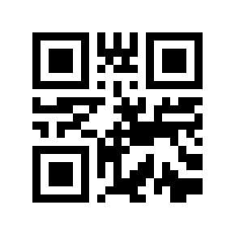

>This is a documentation to the issue #29, the `QR.py` is the script developed to tackle this issue.

</br>

First we start by importing 2 libraries which we will make use of.
```python
import qrcode
import cv2
```

- `qrcode` for the qr code generation
- `cv2` for decoding the qr code

Then we create the class with two main methods `generator` function generates/encodes a qr image with a desired message, and `reader` function reads/decodes a QR-image.
```python
import qrcode
import cv2

class QR():

	def __init__(self):
		pass


	def generator(self, msg, path_to_save_qr_img = None):
		qr_img = qrcode.make(msg)		  
	
		if path_to_save_qr_img == None:
			qr_img.save(f"QR-{msg}.png")
		else:
			qr_img.save(f"{path_to_save_qr_img}/QR-{msg}.png")


	def reader(self, qr_img):
		detector=cv2.QRCodeDetector()
		decoded_msg , one, _=detector.detectAndDecode(qr_img)
		
		return decoded_msg
```

</br>
</br>

#### Test case
```python
from QR import QR
import cv2

qr = QR()

qr.generator('[7,8]')

qr_img = cv2.imread("QR-[7,8].png")
decoded_msg = qr.reader(qr_img)  

print(decoded_msg)
```

- generated qr image:

	

- decoded message
```python  
❯ python3 main.py 
[7,8]
```
