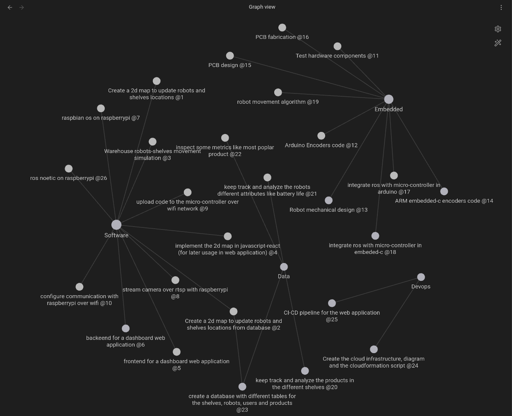
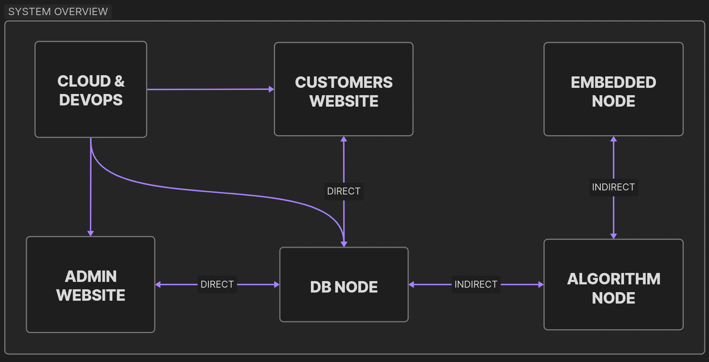
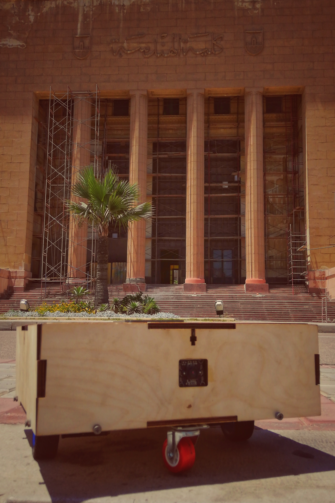

# AMRs-in-Warehouse-Systems
This repository is for our graduation project ‫‪AMRs‬‬ ‫‪in‬‬ ‫‪Warehouse‬‬ ‫‪Systems, A team in the Faculty of Engineering, Alexandria university, majored in Electronics and Communication.


The repository have 5 main branches, main, software, embedded, data and devops. each branch has its corresponding tasks represented in issues.

Inside the `docs` folder there is a documentation for each issue documenting producers taken to solve the issue. 

Our team uses **Obsidian** for documentation and here is an image from the program visualizing each issue/task as a node and its connection to other nodes.


<br/>

## System overview 

Our project tackles a full end-to-end system to operates a warehouse starting from the client side to monitoring the warehouse at the admin side. A warehouse stores a number of packages which is stored inside different shelves, and robots move those shelves autonomously -when an order is made- from point A to B -their current location to the packaging location-. 

To do so, the system was divided into the above parts: 
- Customers website: for customers to access packages and make orders.

- Admin website: for admins to monitor the system in case any problems occurred, developed in react and javascript and apis between the backend and frotend.
<br/>

- Database: to store the warehouse (robots, shelves, packages, ....) different information and customers data, we used postgres.
<br/>

- Cloud and Devops: to create the infrastructure on which the websites and database will work, we used AWS, Jenkins and Circle-Ci.
<br/>

- Algorithm: to control the robots movements inside the warehouse, shortest and free of obstacles path for each robot to minimize time and battery usage and avoid collisions, ad communication between different parts and different robots in the algorithm is done in ROS.
<br/>

- Embedded: the layer which will actually move the robots in the hardware sense, with different sensors, raspberry pi and digital cameras, and developed in ARM.
<br/>

The development of the system was inspired by the **micro services** design so that each part does a specific task and its failure doesn't directly affect the whole system. 

Also some of the system components are **deodorized** so that the system can run on any machine with any os without compatibility issues with one command.


<br/>


## Robot design and demo




[](https://youtu.be/BpZr7LPZxno)

[Demo Video](https://youtu.be/BpZr7LPZxno)

<br/>

## How to run the system locally
For the admin website and the database, the easiest way is to install their docker images from dockerhub and run them with the following commands.


First make the system docker network on which the containers will communicate 
```bash
docker network create warehouse-network
```

<br/>

- For the database
```bash
docker run --name dashboard-database -v database-volume:/shared-volume --network warehouse-network -p 5432:5432 -d eslamdyba/amrs-in-warehouse-systems:dashboard-database-postgres-1.0
```
This command will install the system database docker image, make a container named `dashboard-database` and attach it a volume so data is preserved, and will run it on port 5432.

The database will be empty in a fresh install, you can add initial data with the following:
1. enter the database docker container, this will give you the container shell.
```bash
docker exec -it dashboard-database sh
```

2. login to the database
```bash
psql -h host_name -p port_number -U user_name -d database_name
```

- In our case
```bash
psql -h localhost -p 5432 -U postgres -d AMR_Warehouse
```

3. enter sql commands to insert some data
```bash
INSERT INTO Customers VALUES('C1', 'menna@gmail', 'mennapassword', 'Mennatallah Mamdouh', 'Female');

INSERT INTO Products VALUES('P1', 'Hair Shampoo', 250, 'It is a hair product. It contains Sulfates', 500, 'URL1', 'URL2', 'URL3'),
                            ('P2', 'Hair Conditioner', 300, 'It is a hair product. It controls frizzness', 500, 'URL1', 'URL2', 'URL3');

INSERT INTO Shelves(ShelfID, Location_X, Location_Y, ProductID, NumOfOrders)
VALUES('S1', 0, 5, 'P1', 0), ('S2', 0, 10, 'P2', 0);

INSERT INTO Orders_Details VALUES('O1', 'C1', NULL, NOW(), '+201234567890', 'Alexandria', 'Cash on Delivery', 'New'),
                                    ('O2', 'C1', NULL, NOW(), '+201234567890', 'Alexandria', 'Cash on Delivery', 'New');

INSERT INTO Orders(OrderID, ProductID, Quantity) VALUES('O1', 'P1', 5), ('O1', 'P2', 7), ('O2', 'P1', 7);

INSERT INTO Robots(RobotID, Speed, BatteryPercentage, CurrentLocation_X, CurrentLocation_Y, isCharging, ShelfID)
VALUES('R1', 90, 100, 5, 5, False, 'S1'), ('R2', 80, 50, 10, 10, False, 'S2');
```


<br/>

- For the admin website backend
```bash
docker run --name dashboard-backend -p 5000:5000 --network warehouse-network -d eslamdyba/amrs-in-warehouse-systems:dashboard-backend-1.0
```
This command will install the system admin website backend docker image, make a container named `dashboard-backend` and will run it on port 5000.

<br/>

- For the admin website frontend
```bash
docker run --name dashboard-frontend -p 3001:3000 --network warehouse-network -d eslamdyba/amrs-in-warehouse-systems:dashboard-frontend-1.0

```
This command will install the system admin website frontend docker image, make a container named `dashboard-frontend` and will run it on port 3001. You should see the website running when entering the URL `localhost:3000` on your browser.


<br/>

Now you should see the container running when `docker ps`

you can either install ROS dirctly on your machine, or download its docker image from dockerhub.

Then for the algorithm you can follow the above overview video which explains the different parts of the system and how to run it both as a simulation and hardware.

<br/>

You can find more information and explanation in the `docs` folder.